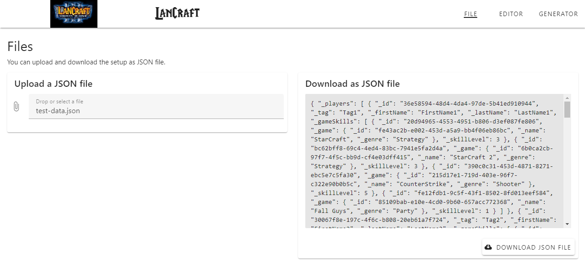
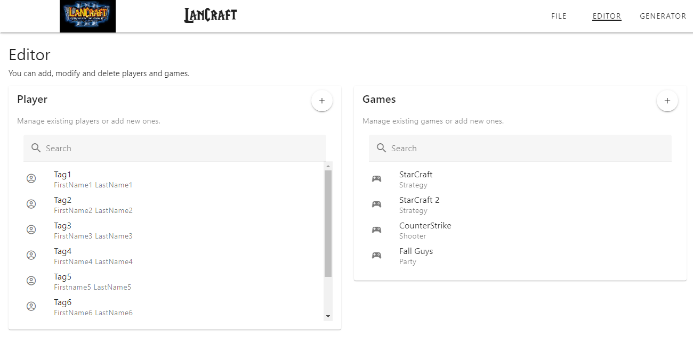
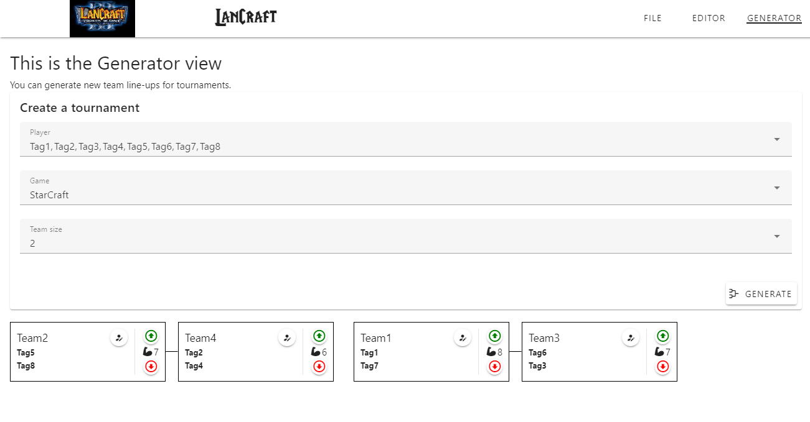

# team-generator

A tool to automatically create team line-ups for tournaments, taking into account the respective player skills.

**Techstack:**
+ Vue 3 (Composition API) with TypeScript & Pinia as state management library
+ Vuetify (Component Framework)

### [View on netlify.app](https://lancraft.netlify.app/)

  